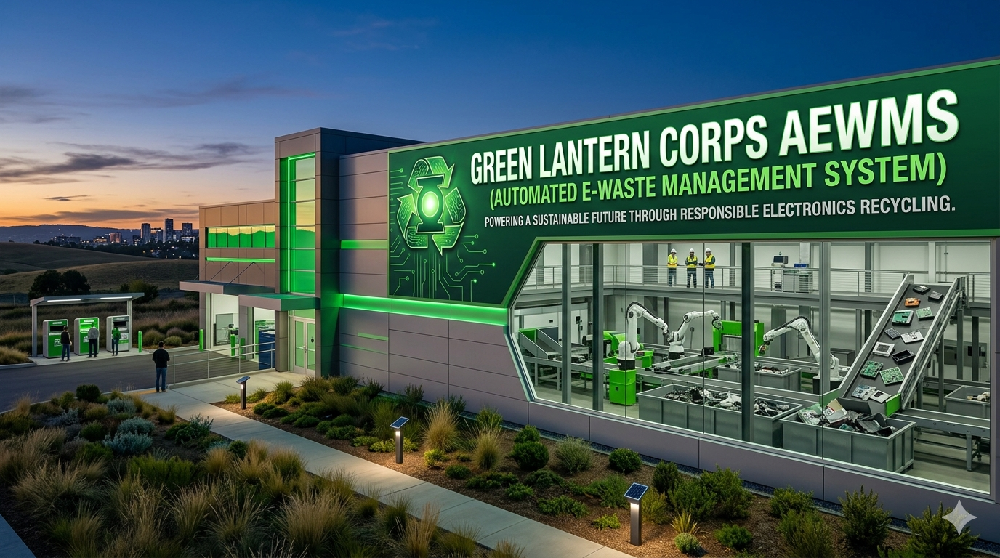

<p align="center">
  
</p>

# Automated E-Waste Management System

A Python-based Terminal User Interface (TUI) application designed to automate electronic waste management, calculate recycling fees (with bulk discounts), monitor storage capacity limits, and flag hazardous materials exceeding safety periods

## ⚙️ How To Run

1. Make sure you have Python installed on your machine.
2. Place the script into a directory.
3. Open your terminal/command prompt, navigate to the folder, and run:
   ```bash
   python main.py
## 📂 File Structure

* `main.py` - The core application script containing the system logic and menus.
* `items.json` - Flat-file data store where each line holds a JSON object representing an item.
* `config.json` - Configuration profile used to track and store maximum system storage capacity.
